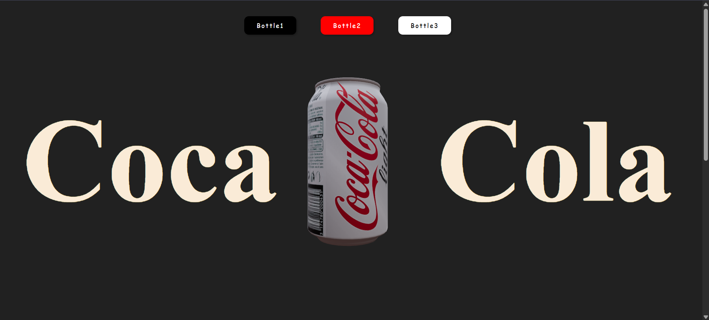
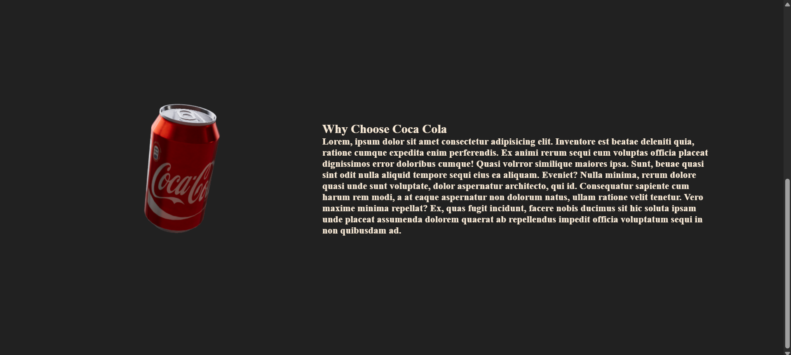

# 🥤 3D Coca-Cola Cans – React Three Fiber  

A visually stunning **3D Coca-Cola can showcase** built with **React Three Fiber (R3F)** and **Vite**.  
This project demonstrates how to integrate and render 3D models in a modern React environment with smooth interactions and performance optimization.  

---

## ✨ Features  

- ⚡ **Vite-powered** – blazing fast development & builds.  
- 🎨 **React Three Fiber (R3F)** for 3D rendering.  
- 🥤 **3 detailed Coca-Cola can models**.  
- 🎥 Interactive 3D environment with orbit controls.  
- 📱 Responsive & lightweight design.  

---

## 🚀 Tech Stack  

- **Vite** – Next-gen frontend tooling.  
- **React** – UI framework.  
- **React Three Fiber (R3F)** – React renderer for Three.js.  
- **Three.js** – Powerful 3D rendering engine.  

---

## 📂 Project Structure  

```bash
📦 3d-coca-cola-cans
├── public/            # Static assets (3D models)
├── src/               # Main app entry
│   └── index.css      # Css File
│   └── main.jsx       # Vite + React bootstrap
└── package.json
```

---

## ⚙️ Installation & Setup  

```bash
# Clone this repo
git clone https://github.com/AnshulVishwa/Coca-Cola.git

# Navigate to project
cd 3d-coca-cola-cans

# Install dependencies
npm install

# Start development server
npm run dev
```

---

## 🎮 Usage  

- Open the app in your browser.  
- Use your **mouse / touch** to rotate, zoom, and explore the 3D Coca-Cola cans.  

---

## 📸 Preview  




---

## 💡 Future Enhancements  

- ✅ Add animations to the cans (e.g., rotation, floating effect).  
- ✅ Include different Coca-Cola can designs.  
- ✅ Add lighting variations for realism.  

---

## 🤝 Contributing  

Contributions, issues, and feature requests are welcome!  
Feel free to open an issue or submit a pull request.  

---

## 📜 License  

This project is licensed under the **MIT License**.  

---

## ❤️ Acknowledgements  

- [React Three Fiber](https://docs.pmnd.rs/react-three-fiber)  
- [Three.js](https://threejs.org/)  
- Coca-Cola for the inspiration 🥤  
